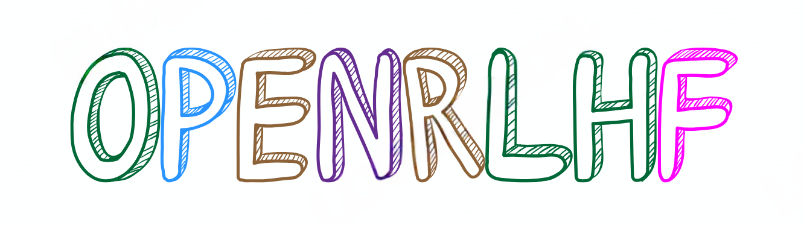

<div align="center">
    
</div>
<div align="center">
<p align="center">
      <a href="https://github.com/OpenRLHF/OpenRLHF/graphs/contributors">
        
      </a>
      <a href="https://github.com/OpenRLHF/OpenRLHF/issues">
        
      </a>
      <a href="https://github.com/OpenRLHF/OpenRLHF/discussions">
        
      </a>
      <a href="https://github.com/OpenRLHF/OpenRLHF/pulls">
        
      <a href="https://github.com/OpenRLHF/OpenRLHF/stargazers">
        
      </a>
      <br>
      <em>Open-source / Comprehensive / Lightweight / Easy-to-use</em>
    </p>
</p>
</div>

<hr>

<span>[ English | <a href="README_zh.md">中文</a> ]</span>

OpenRLHF is a high-performance RLHF framework built on Ray, DeepSpeed and HF Transformers:

- **Simple and easy to use**: OpenRLHF is one of the simplest high-performance RLHF libraries currently available, and seamlessly compatible with Huggingface models and datasets.
- **High performance**: RLHF training spends 80% of the time on the sample generation stage. Thanks to the ability to use a large inference batch size with Ray and Packing Samples and vLLM generation acceleration, the performance of OpenRLHF 3~4x+ that of Optimized DeepSpeedChat with Hybrid Engine.
- **Distributed RLHF**:  OpenRLHF distribute the Actor, Reward, Reference, and Critic models onto separate GPUs using Ray, while placing the Adam optimizer on the CPU. This enables full-scale fine-tuning of 70B+ models with multiple A100 80G GPUs and vLLM and 7B models across multiple 24GB RTX 4090 GPUs.
- **PPO Implementation Optimization**: We integrated the implementation tricks for PPO to improve the training stability, referencing [Zhihu](https://zhuanlan.zhihu.com/p/622134699) and the [Notion blog](https://difficult-link-dd7.notion.site/eb7b2d1891f44b3a84e7396d19d39e6f?v=01bcb084210149488d730064cbabc99f).

More details are in [Slides](https://docs.google.com/presentation/d/1JRhB1d7csofx0PIZBmfyBdMluxNd5JLPpUHrrvVhGnk/edit?usp=sharing) | [Technical Report](https://arxiv.org/abs/2405.11143) | [Documents](https://openrlhf.readthedocs.io/)


## Features

- Distributed [PPO](./examples/scripts/train_ppo_llama_ray.sh)/[Reinforce](./examples/scripts/train_reinforce_llama_ray.sh) based on Ray. 
- Support full RLHF fine-tuning of models with [over 70 billion parameters](./examples/scripts/train_ppo_llama_ray_70b.sh).
- Support vLLM generation acceleration in RLHF (--vllm_num_engines).
- Support multiple reward models (--reward_pretrain model1,model2...) and remote reward model(--remote_rm_url).
- Support [DPO (direct-preference-optimization)/IPO/cDPO](./examples/scripts/train_dpo_llama.sh).
- Support [Kahneman-Tversky optimization (KTO)](./examples/scripts/train_kto_llama.sh).
- Support [Rejection Sampling](./examples/scripts/train_rejection_sampling_llama.sh).
- Support [Iterative DPO](./examples/scripts/train_iterative_dpo_llama.sh) (https://github.com/RLHFlow/Online-RLHF).
- Support [Conditional SFT](./examples/scripts/train_conditional_llama.sh) (https://arxiv.org/abs/2308.12050).
- Support [Knowledge Distillation](./examples/scripts/train_knowledge_distillation.sh) (https://github.com/microsoft/LMOps/tree/main/minillm).
- Support [Process Reward Model (PRM)](./examples/scripts/train_prm_mistral.sh).
- Support SFT/DPO/RM/PRM/PPO training samples packing (--packing_samples).
- Support [RingAttention](./examples/scripts/train_dpo_ring_llama.sh) (--ring_attn_size, --ring_head_stride)
- Support [MoE](./examples/test_scripts/train_sft_mixtral_lora.sh) (--aux_loss_coef)
- Support FlashAttention2 (--flash_attn).
- Support QLoRA (--load_in_4bit), [LoRA (--lora_rank, --target_modules)](./examples/scripts/train_sft_mixtral_lora.sh).
- Support HuggingFace `tokenizer.apply_chat_template` in datasets (--apply_chat_template and --input_key).
- Support Wandb log (--use_wandb) and tensorboard (--use_tensorboard).
- Support for recovering from checkpoint (--load_checkpoint and --save_steps).
- Multi-nodes [training scripts](./examples/scripts/train_llama_slurm.sh) for Slurm.

### PPO Support Matrix

| Feature | OpenRLHF | DSChat | CAIChat | TRL |
| ------------- |:-------------:| :-------------:| :-------------:| :-------------:|
| 70B+ Full Tuning with 16 A100-80GB      | ✅ | ❌ | ❌ | ❌ |
| 7B Full Tuning with 4 RTX4090 | ✅      |    ❌ | ❌ | ❌ |
| 34B DPO Full Tuning with 8 A100-80GB | ✅      |    ❌ | ❌ | ❌ |  
| Inference Engine in PPO | ✅      |    ✅ | ❌ | ❌ |  
| PPO Implementation Tricks | ✅      |    ❌ | ❌ | ✅ |
| Support QLoRA | ✅      |    ❌ | ❌ | ✅ | 
| Support Mixtral 8*7b | ✅      |    ❌ | ❌ | ❌ |  
| Support Unmerged Actor-Critic | ✅     |   ✅ | ✅ | ❌ | 
| Support Multiple Reward Models | ✅      |    ❌ | ❌ | ❌ |   
| Support Huggingface Models | ✅      |    ✅ | ✅ | ✅ | 
| Easy-to-use | ✅      |   ❌ (HybridEngine bugs) | ✅ | ✅ | 


## Quick Start

### Installation

To use OpenRLHF, first launch the docker container (**Recommended**) and `pip install` openrlhf inside the docker container:

```bash
# Launch the docker container
docker run --runtime=nvidia -it --rm --shm-size="10g" --cap-add=SYS_ADMIN -v $PWD:/openrlhf nvcr.io/nvidia/pytorch:24.02-py3 bash
sudo pip uninstall xgboost transformer_engine flash_attn -y

# Or git clone
git clone https://github.com/wilkincr/585project.git
cd OpenRLHF
pip install -e .
```
### Run
In openrlhf directory:
```bash
./examples/script/train_ppo_qwen_small.sh
```
